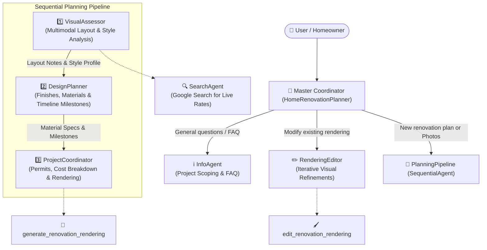

# 🏚️ AI Home Renovation Planner — Multi-Agent System

[](https://www.python.org/)
[](https://google.github.io/adk-docs/)
[](https://ai.google.dev/)
[](LICENSE)

An intelligent, production-ready **Agentic AI Home Renovation Planner** built with the **Google ADK (Agent Development Kit)** and **Google Gemini Multimodal AI** (`gemini-3.6-flash`).

The system acts as a virtual team of interior designers, architects, and general contractors. It visually inspects room and inspiration photos, enforces strict architectural layout preservation, calculates itemized renovation budgets with expected ROI, checks municipal building/electrical/plumbing codes, recommends materials across multiple budget tiers, and produces photorealistic architectural renderings with conversational, iterative refinement.

---

## 🌟 Key Highlights & Capabilities

- 🔍 **Multimodal Vision & Room Inspection**  
  Accepts uploaded room photos and style inspiration images. Automatically distinguishes between existing space photos and design inspirations, detecting room condition, dimensions, lighting, and aesthetic styles.

- 📐 **Strict Layout Preservation**  
  Unlike standard image generators that change walls and doors, the system documents and locks the exact positions of windows, doorways, cabinetry footprints, and utility rough-ins, focusing alterations strictly on surface finishes and fixtures.

- 💰 **Itemized Budget & ROI Breakdown**  
  Provides cost modeling for 10+ room types across 4 renovation scopes (*Cosmetic*, *Moderate*, *Full*, *Luxury*):
  - 📦 Materials & Finishes (42%)
  - 👷 Professional Labor & Trades (45%)
  - 📄 Permits & Inspections (3%)
  - 🛡️ Contingency Reserve Fund (10%)
  - 📈 Estimated Resale Home Equity ROI Range

- 📋 **Building Permit & Code Advisor**  
  Evaluates renovation plans against International Residential Code (IRC) and National Electrical Code (NEC) standards, identifying required structural, plumbing, and electrical permits as well as mandatory inspection milestones.

- 🎨 **Curated Materials & Finishes Recommender**  
  Recommends specific materials, paint codes, countertops, cabinetry types, and flooring suited to the target room and style across *Budget-Friendly*, *Moderate*, and *Luxury* tiers.

- 🖼️ **Photorealistic Rendering via the SLC Formula**  
  Generates architectural renderings using prompt engineering based on the **SLC Formula** (**S**ubject, **L**ighting, **C**amera) and saves versioned outputs directly into the session artifacts panel.

- ✏️ **Conversational Iterative Refinement**  
  Allows homeowners to converse naturally to refine existing renderings (e.g. *"Change the cabinets from white to sage green and add matte black hardware"*), updating versions without starting over.

- ⏱️ **Phased Milestone Timeline**  
  Generates project schedules from initial permitting and demolition to rough-ins, finish installation, and final inspections.

---

## 🧠 Multi-Agent Architecture

The system utilizes Google ADK's **Coordinator / Dispatcher Pattern** paired with a **Sequential Agent Pipeline**:



### Agents Overview

| Agent Name | Type | Model | Primary Responsibilities |
| :--- | :--- | :--- | :--- |
| **`HomeRenovationPlanner`** | Coordinator | `gemini-3.6-flash` | Analyzes user intent and routes queries to dedicated specialists using ADK `transfer_to_agent`. |
| **`InfoAgent`** | Specialist | `gemini-3.6-flash` | Onboards users, answers renovation questions, and explains system capabilities. |
| **`VisualAssessor`** | Sequential Specialist | `gemini-3.6-flash` | Performs multimodal vision analysis on room photos, identifies structural constraints, and scopes costs. |
| **`DesignPlanner`** | Sequential Specialist | `gemini-3.6-flash` | Selects surface finishes, matches color palettes, and creates a phased timeline. |
| **`ProjectCoordinator`** | Sequential Specialist | `gemini-3.6-flash` | Evaluates permits/codes, computes consolidated budgets, and triggers rendering generation. |
| **`RenderingEditor`** | Specialist | `gemini-3.6-flash` | Retrieves previous rendering artifacts and applies specific design edits requested by the user. |
| **`SearchAgent`** | Tool Agent | `gemini-3.6-flash` | Performs live Google searches for material pricing, local labor averages, and design trends. |

---

## 🛠️ Specialized Tool Catalog

| Tool Function | File | Description |
| :--- | :--- | :--- |
| `estimate_renovation_cost` | `agent.py` | Calculates itemized costs (materials, labor, permits, contingency) and resale ROI for 10+ room types. |
| `calculate_timeline` | `agent.py` | Generates a structured, phase-by-phase schedule from demolition to final punch list. |
| `check_renovation_permits` | `tools.py` | Assesses building, electrical, and plumbing permit needs and lists required inspection milestones. |
| `recommend_materials_and_finishes` | `tools.py` | Recommends curated countertops, cabinetry, flooring, and paint with price ranges per sq ft. |
| `generate_renovation_rendering` | `tools.py` | Generates photorealistic visual renderings using the SLC formula and saves versioned image artifacts. |
| `edit_renovation_rendering` | `tools.py` | Loads existing rendering artifacts, applies targeted modifications, and saves incremented versions. |
| `list_renovation_renderings` | `tools.py` | Lists all generated renderings and version history for the current session. |
| `list_reference_images` | `tools.py` | Lists all room and inspiration reference photos uploaded during the session. |
| `save_uploaded_image_as_artifact`| `tools.py` | Persists user-uploaded photos as named artifacts for reference during rendering. |

---

## 📁 Repository Structure

```text
Home_Renovation/
│
├── agent.py               # Coordinator agent, Sequential pipeline, and specialist definitions
├── tools.py               # Multimodal rendering, editing, permits, materials, and artifact tools
├── main.py                # Unified CLI runner, Web UI launcher, and pre-flight diagnostics
├── test_agent.py          # Automated unit test suite (9 test cases covering tools and agent hierarchy)
├── requirements.txt       # Project dependencies
├── .env.example           # Environment variables template
├── .gitignore             # Git exclusion rules (keeps API keys and local databases secure)
└── README.md              # Project documentation
```

---

## ⚡ Quick Start & Installation

### 1. Clone the Repository
```bash
git clone https://github.com/Vaibhav-dev74/Home_Renovation.git
cd Home_Renovation
```

### 2. Create and Activate a Virtual Environment

**Windows (PowerShell):**
```powershell
python -m venv .venv
.\.venv\Scripts\Activate.ps1
```

**macOS / Linux:**
```bash
python3 -m venv .venv
source .venv/bin/activate
```

### 3. Install Dependencies
```bash
pip install -r requirements.txt
```

### 4. Configure Your Gemini API Key
Create a `.env` file in the project root:
```bash
cp .env.example .env
```
Open `.env` and add your Google Gemini API key:
```env
GOOGLE_API_KEY=your_actual_gemini_api_key_here
```
> 💡 **Get a Free API Key**: You can obtain a free Gemini API key in seconds from [Google AI Studio](https://aistudio.google.com/app/apikey).

---

## 🖥️ How to Run the Application

This project provides a unified launcher (`main.py`) with automatic port detection and collision handling.

### Option 1: Web UI Mode (Recommended — Browser Chat & Visual Uploads)
```bash
python main.py --web
```
*Alternatively, using the native ADK CLI:*
```bash
adk web ..
```
Then open your browser and navigate to:
👉 **`http://localhost:8000`** *(or the port displayed in your terminal)*

Features in Web UI:
- Interactive chat with live streaming responses.
- Upload photos of your current room or inspiration boards using the attachment button.
- View and download generated photorealistic renderings in the **Artifacts** panel on the right sidebar.

---

### Option 2: Interactive Terminal CLI Mode
To chat with the multi-agent system directly from your command line:
```bash
python main.py
```
*Alternatively, using the native ADK CLI:*
```bash
adk run ..\ai_home_renovation_agent
```

---

### Option 3: Pre-Flight Health Check
Run a quick diagnostic check to verify your environment, API key, multi-agent tree, and tools:
```bash
python main.py --check
```

---

### Option 4: Custom Port
If port 8000 is occupied, `main.py` will automatically switch to the next free port. You can also specify a port explicitly:
```bash
python main.py --web --port 8080
```

---

## 💬 Example Prompts to Try

### 1. Planning a Space from Scratch
> *"I have a 180 sq ft kitchen with outdated laminate countertops and dark cabinets. My budget is $20,000 and I want a bright modern aesthetic. Please create a renovation plan."*

### 2. Multimodal Photo Analysis
> *(Upload a picture of your current bathroom using the attachment icon)*  
> *"Here is my master bathroom. I want to replace the fiberglass tub with a walk-in shower and add a double vanity. What permits do I need, what is the cost breakdown, and what will the schedule look like?"*

### 3. Conversational Design Refinements
> *"I like the kitchen rendering, but can we change the cabinet finish to Sherwin-Williams Naval blue and swap the hardware to brushed brass?"*

---

## 🧪 Running Automated Tests

A comprehensive unit test suite is included to verify calculations, material recommendations, permit logic, and multi-agent hierarchy:

```bash
python -m unittest test_agent.py
```

Expected Output:
```text
.........
----------------------------------------------------------------------
Ran 9 tests in 0.012s

OK
```

---

## 🔒 Security Best Practices

- **API Keys**: Keys are kept strictly in `.env` and are excluded from Git via `.gitignore`.
- **Local Databases**: SQLite session databases (`.adk/session.db`) and temporary files are automatically ignored to prevent committing local session history.

---

## 📄 License

This project is licensed under the MIT License — see the [LICENSE](LICENSE) file for details.