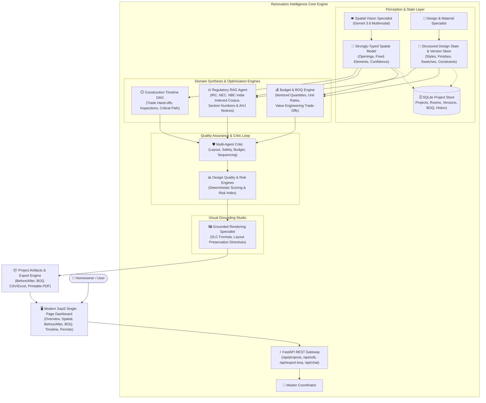
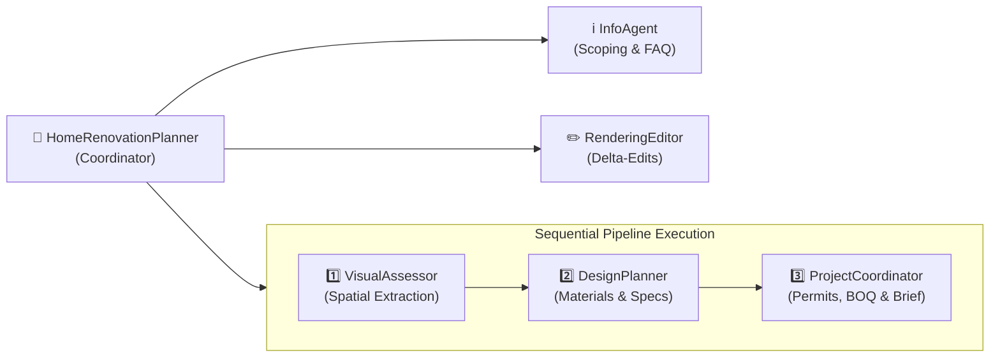
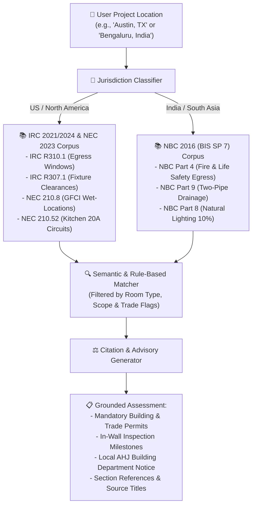
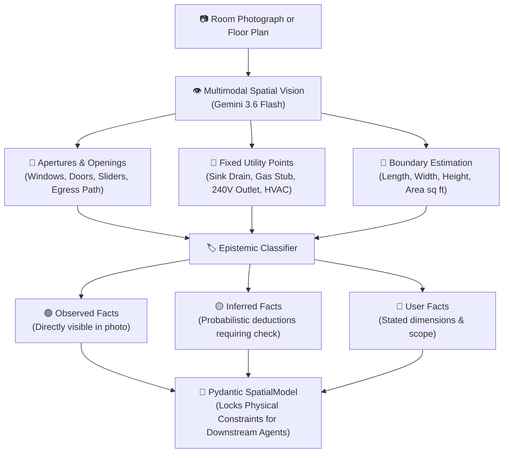

# 🏚️ AI Home Renovation Intelligence Platform — Enterprise V2.5

[](https://www.python.org/)
[](https://fastapi.tiangolo.com/)
[](https://google.github.io/adk-docs/)
[](https://ai.google.dev/)
[](https://sqlite.org/)
[](LICENSE)

An enterprise-grade **AI Home Renovation Intelligence Platform** built with **Google ADK (Agent Development Kit)**, **Google Gemini Multimodal AI** (`gemini-3.6-flash` / `gemini-3.8-flash`), and **FastAPI**.

The platform behaves as an autonomous, multidisciplinary team of interior designers, structural architects, computer vision specialists, cost estimators, building-code advisors, material procurement specialists, and construction critics. Homeowners upload room photos or floor plans, specify budgets and locations, and receive a mathematically grounded, code-compliant, and shareable renovation master plan.

---

## 📑 Table of Contents

- [Problem Statement](#-problem-statement)
- [Key Capabilities](#-key-capabilities)
- [System Architecture](#-system-architecture)
- [Multi-Agent Orchestration](#-multi-agent-orchestration)
- [Regulatory RAG Architecture](#-regulatory-rag-architecture)
- [Spatial Intelligence Pipeline](#-spatial-intelligence-pipeline)
- [Tech Stack](#-tech-stack)
- [Project Directory Structure](#-project-directory-structure)
- [Installation & Quick Start](#-installation--quick-start)
- [REST API Reference](#-rest-api-reference)
- [Testing & Quality Verification](#-testing--quality-verification)
- [AI Safety & Disclaimers](#-ai-safety--disclaimers)
- [License](#-license)

---

## 🎯 Problem Statement

Residential home renovations are plagued by three systemic failures:
1. **Unrealistic AI Renderings**: Standard image diffusion models hallucinate structural transformations—erasing load-bearing columns, relocating water stacks into thin air, and ignoring building apertures.
2. **Budget Disconnect & Hidden Costs**: Rough contractor multipliers lack transparent Bill of Quantities (BOQ), causing 30–50% cost blowouts due to concealed trade rough-ins and material wastage.
3. **Regulatory Blind Spots**: Model codes (IRC, NEC, NBC) and municipal Authority Having Jurisdiction (AHJ) inspection requirements are discovered late, causing costly stop-work orders and tear-outs.

**RenovAI Intelligence** bridges the gap between creative interior design and physical job-site reality using structured spatial models, deterministic cost optimization, and verified regulatory RAG retrieval.

---

## 🌟 Key Capabilities

### 1. 🎮 3D / VR Spatial Room Studio & Walkthrough
- **Three.js WebGL Interactive Studio**: Realistic 3D room canvas with true physical dimensions (e.g. 12ft × 15ft) and a 1-foot coordinate measurement grid.
- **True Physical Scale Placement**: Products (islands, refrigerators, sinks, vanities, dining tables) are rendered strictly to their real-world dimensions (Width × Depth × Height in inches & feet).
- **Multi-Perspective Navigation**:
  - **3D Orbit View**: 360° free rotation, panning, and zoom around the architectural model.
  - **Top-Down 2D Floorplan**: Orthographic view for spacing and door/window clearances.
  - **First-Person Walkthrough (VR Perspective)**: Eye-level 5.5 ft walkthrough camera inside the room to realistically experience space, headroom, and aisles.
- **Physical Collision & Clearance Validation**: Real-time collision detection warns against overlapping furniture and flags tight walkways narrower than the 36-inch standard aisle code.
- **Interactive Spatial HUD**: Click any object in 3D to inspect retailer, price, dimensions, and nudge position (±0.5 ft) or rotate 90°.

### 2. 📸 Live Architectural Room Camera Scanner (Zero Upload Friction)
- **Direct Camera / Webcam Capture**: Capture room images directly through your device webcam, laptop camera, or smartphone/tablet camera without the need to take photos beforehand, save to disk, or upload image files.
- **Architectural AR HUD Overlay**: Real-time alignment grid (rule-of-thirds), level horizon crosshairs, corner brackets, and framing prompts guiding optimal spatial capture.
- **Live Spatial Synthesis (`POST /api/projects/{id}/camera-scan`)**: Streams frame directly to backend spatial vision, infers room dimensions ($W \times L \times H$), identifies openings/fixtures, and immediately updates 3D studio boundaries.
- **Device Flexibility**: Supports camera switching (Front vs. Back/Environment Wide-angle), resolution optimization, and instant review/retake flows.

### 3. 🛒 Real-Time Product Catalog & Location Marketplace
- **Location-Specific Sourcing**: Filter by city/region (**Bengaluru, Mumbai, Delhi NCR, Hyderabad, Pune, Austin TX, San Francisco CA, New York NY**) so only products available in the user's market are displayed.
- **Authentic Retail Pricing & Brands**: Real-world items from **IKEA, Kohler, Samsung, Pepperfry, Urban Ladder, Home Depot, Faber, Carysil, Philips Hue**.
- **One-Click 3D Placement**: Click *"➕ Place in 3D"* to immediately drop the item into the room and dynamically sync the Bill of Quantities (BOQ) and Cart.

### 4. 📍 User Location Customization & Browser GPS Auto-Detection
- **Dynamic Location Switching**: Switch project location/jurisdiction at any time directly from the top navigation bar or via conversational AI (*"Change location to Mumbai"*).
- **One-Click Browser GPS Auto-Detection**: Leverages HTML5 `navigator.geolocation` with reverse geocoding via OpenStreetMap Nominatim and timezone fallback to automatically identify the user's exact city and country with zero manual typing.
- **Regional Presets & Custom Addressing**: Instant presets for top Indian and US/Global metropolitan markets or enter any custom city, state, or postal zip.
- **Automatic Currency & Budget Envelope Conversion**: Automatically adapts between Indian Rupee (**INR ₹**) and US Dollar (**USD $**), proportionally scaling target budgets, labor rates, and marketplace product pricing.
- **Live Building Code & Permit Recalculation**: Instant re-evaluation of regulatory standards via Regulatory RAG (e.g., switching to India prompts **NBC 2016 Part 4/8/9** while switching to the US prompts **IRC 2021 / NEC 2023**), immediately updating contractor labor rates, BOQ, and value engineering.

### 5. 📐 Spatial Intelligence & Aperture Locking
- Extracts a strongly typed Pydantic `SpatialModel` from room photos or floor plans.
- Strictly documents physical openings (windows, doors, cased thresholds) and utility rough-ins (sink drains, 240V lines, gas stubs).
- Clearly demarcates **Observed** visual facts from **Inferred** assumptions and **User-Provided** inputs.

### 6. 💎 Non-Destructive Design State & Conversational Editor
- Maintains persistent `DesignState` tracking cabinetry, countertops, flooring, paint, lighting, and hardware.
- Non-destructive delta-updating: commanding *"Make the cabinets sage green"* updates only the cabinet finish while preserving countertop stone, flooring, and room layout.
- Maintains version history (`v1`, `v2`, `v3`) with changelogs and design rationales.

### 7. 💰 Automated Bill of Quantities (BOQ) & Value Engineering
- Mathematically derives material and labor requirements from room dimensions with configurable cutting waste margins (10% on tile, 2 finish coats on paint).
- Live synchronizes placed 3D products directly into the BOQ Cart with itemized retailer pricing.
- Supports both **INR (₹)** and **USD ($)**.
- If scope exceeds the target budget, the **Budget Optimizer** automatically proposes trade-offs (e.g. Italian marble → engineered quartz, saving ₹45,000 / $4,200) without compromising core layout.
- Exportable to **CSV (Excel)** and **Printable HTML/PDF**.

### 8. ⚖️ Grounded Regulatory RAG Permit Advisor
- Queries a verified regulatory corpus:
  - **International Residential Code (IRC 2021/2024)**: Egress apertures (IRC R310), plumbing clearances (IRC R307), drainage pipe slopes (IRC P3005).
  - **National Electrical Code (NEC 2023 NFPA 70)**: Wet-location GFCI protection (NEC 210.8), dedicated 20A kitchen branch circuits (NEC 210.52).
  - **National Building Code of India (NBC 2016)**: Fire safety egress (Part 4), two-pipe soil separation (Part 9), natural lighting minimums (Part 8).
- Provides grounded citations with section numbers and local municipal AHJ notices. Never hallucinates legal code.

### 9. ⏱️ Construction Timeline DAG & Critical Path
- Models construction as a Directed Acyclic Graph (DAG) with explicit trade handoffs (Demolition → MEP rough-ins → City inspection → Drywall → Tiling → Cabinetry → Fixture trims).
- Automatically calculates total working days, calendar duration, and critical path bottlenecks.

### 10. 🛡️ Multi-Agent Critic & Renovation Risk Engine
- Automated 5-pillar validation: Layout clashes, budget compliance, safety codes, trade sequencing, and user intent.
- Deterministic 6-pillar **Design Quality Score** (0–100) and multi-domain **Renovation Risk Matrix** (Structural, Plumbing, Electrical, Budget, Timeline).

---

## 🏗️ System Architecture


```mermaid
flowchart TD
    User([👤 Homeowner / User]) --> WebUI["🖥️ Modern SaaS Single-Page Dashboard\n(Overview, Spatial, Before/After, BOQ, Timeline, Permits)"]
    WebUI --> APIGateway["⚡ FastAPI REST Gateway\n(/api/projects, /api/edit, /api/export-boq, /api/chat)"]
    
    subgraph CoreEngine ["Renovation Intelligence Core Engine"]
        APIGateway --> MasterCoord["🎯 Master Coordinator"]
        
        subgraph PerceptionMemory ["Perception & State Layer"]
            VisionAgent["👁️ Spatial Vision Specialist\n(Gemini 3.6 Multimodal)"] --> SpatialModel["📐 Strongly-Typed Spatial Model\n(Openings, Fixed Elements, Confidence)"]
            DesignAgent["🎨 Design & Material Specialist"] --> DesignState["💎 Structured Design State & Version Store\n(Styles, Finishes, Swatches, Constraints)"]
            ProjectDB[(🗄️ SQLite Project Store\nProjects, Rooms, Versions, BOQ, History)]
            SpatialModel -.-> ProjectDB
            DesignState -.-> ProjectDB
        end
        
        subgraph SynthesisEngine ["Domain Synthesis & Optimization Engines"]
            CostEngine["💰 Budget & BOQ Engine\n(Itemized Quantities, Unit Rates,\nValue Engineering Trade-Offs)"]
            PermitRAG["⚖️ Regulatory RAG Agent\n(IRC, NEC, NBC India Indexed Corpus,\nSection Numbers & AHJ Notices)"]
            TimelineDAG["⏱️ Construction Timeline DAG\n(Trade Hand-offs, Inspections, Critical Path)"]
            
            SpatialModel --> CostEngine
            DesignState --> CostEngine
            SpatialModel --> PermitRAG
            DesignState --> PermitRAG
            SpatialModel --> TimelineDAG
        end
        
        subgraph QualityCritic ["Quality Assurance & Critic Loop"]
            CriticAgent["🛡️ Multi-Agent Critic\n(Layout, Safety, Budget, Sequencing)"]
            CostEngine --> CriticAgent
            PermitRAG --> CriticAgent
            TimelineDAG --> CriticAgent
            CriticAgent --> QualityRisk["📊 Design Quality & Risk Engines\n(Deterministic Scoring & Risk Index)"]
        end
        
        subgraph VisualStudio ["Visual Grounding Studio"]
            RenderAgent["🖼️ Grounded Rendering Specialist\n(SLC Formula, Layout Preservation Directives)"]
            QualityRisk --> RenderAgent
        end
    end
    
    RenderAgent --> Exports["📦 Project Artifacts & Export Engine\n(Before/After, BOQ CSV/Excel, Printable PDF)"]
    Exports --> WebUI
```

---

## 🤖 Multi-Agent Orchestration

The platform combines Google ADK's **Coordinator / Dispatcher Pattern** with a **Sequential Agent Pipeline**:


```mermaid
flowchart LR
    Root["🎯 HomeRenovationPlanner\n(Coordinator)"] --> Info["ℹ️ InfoAgent\n(Scoping & FAQ)"]
    Root --> Editor["✏️ RenderingEditor\n(Delta-Edits)"]
    Root --> Seq["🔄 PlanningPipeline\n(Sequential)"]
    
    subgraph Seq ["Sequential Pipeline Execution"]
        direction LR
        S1["1️⃣ VisualAssessor\n(Spatial Extraction)"] --> S2["2️⃣ DesignPlanner\n(Materials & Specs)"]
        S2 --> S3["3️⃣ ProjectCoordinator\n(Permits, BOQ & Brief)"]
    end
```

| Agent Name | ADK Type | Model | Primary Mission |
| :--- | :--- | :--- | :--- |
| **`HomeRenovationPlanner`** | Coordinator | `gemini-3.6-flash` | Analyzes homeowner intent and dispatches queries to dedicated specialists. |
| **`VisualAssessor`** | Sequential Specialist | `gemini-3.6-flash` | Extracts spatial boundaries, detects apertures, and isolates utility rough-in points. |
| **`DesignPlanner`** | Sequential Specialist | `gemini-3.6-flash` | Formulates coordinated material palettes and schedules. |
| **`ProjectCoordinator`** | Sequential Specialist | `gemini-3.6-flash` | Reconciles permits, compiles consolidated BOQ, and triggers rendering prompts. |
| **`RenderingEditor`** | Specialist | `gemini-3.6-flash` | Applies non-destructive delta edits to existing design states. |
| **`SearchAgent`** | Tool Agent | `gemini-3.6-flash` | Researches live material rates and contractor labor trends. |

---

## ⚖️ Regulatory RAG Architecture


```mermaid
flowchart TD
    UserLoc["📍 User Project Location\n(e.g., 'Austin, TX' or 'Bengaluru, India')"] --> JurDetect["🧭 Jurisdiction Classifier"]
    
    JurDetect -->|"US / North America"| IRC_NEC["📚 IRC 2021/2024 & NEC 2023 Corpus\n- IRC R310.1 (Egress Windows)\n- IRC R307.1 (Fixture Clearances)\n- NEC 210.8 (GFCI Wet-Locations)\n- NEC 210.52 (Kitchen 20A Circuits)"]
    
    JurDetect -->|"India / South Asia"| NBC_India["📚 NBC 2016 (BIS SP 7) Corpus\n- NBC Part 4 (Fire & Life Safety Egress)\n- NBC Part 9 (Two-Pipe Drainage)\n- NBC Part 8 (Natural Lighting 10%)"]
    
    IRC_NEC --> Retrieval["🔍 Semantic & Rule-Based Matcher\n(Filtered by Room Type, Scope & Trade Flags)"]
    NBC_India --> Retrieval
    
    Retrieval --> CitationEngine["⚖️ Citation & Advisory Generator"]
    CitationEngine --> Output["📋 Grounded Assessment:\n- Mandatory Building & Trade Permits\n- In-Wall Inspection Milestones\n- Local AHJ Building Department Notice\n- Section References & Source Titles"]
```

---

## 📐 Spatial Intelligence Pipeline


```mermaid
flowchart TD
    ImgIn["📷 Room Photograph or Floor Plan"] --> VisionModel["👁️ Multimodal Spatial Vision\n(Gemini 3.6 Flash)"]
    
    VisionModel --> AperturePass["🚪 Apertures & Openings\n(Windows, Doors, Sliders, Egress Path)"]
    VisionModel --> UtilityPass["🚰 Fixed Utility Points\n(Sink Drain, Gas Stub, 240V Outlet, HVAC)"]
    VisionModel --> DimensionPass["📏 Boundary Estimation\n(Length, Width, Height, Area sq ft)"]
    
    AperturePass --> Classifier["🏷️ Epistemic Classifier"]
    UtilityPass --> Classifier
    DimensionPass --> Classifier
    
    Classifier --> FactObs["🟢 Observed Facts\n(Directly visible in photo)"]
    Classifier --> FactInf["🟡 Inferred Facts\n(Probabilistic deductions requiring check)"]
    Classifier --> FactUser["🔵 User Facts\n(Stated dimensions & scope)"]
    
    FactObs --> SpatialModel["📐 Pydantic SpatialModel\n(Locks Physical Constraints for Downstream Agents)"]
    FactInf --> SpatialModel
    FactUser --> SpatialModel
```

---

## 💻 Tech Stack

| Domain | Technology | Details |
| :--- | :--- | :--- |
| **Language & Runtime** | Python 3.10+ / 3.13 | Core backend language |
| **Agent Framework** | Google ADK (`google-adk>=1.15.0`) | `LlmAgent`, `SequentialAgent`, `AgentTool` |
| **Multimodal Foundation Models** | Google Gemini API (`google-genai`) | `gemini-3.6-flash`, fallback to `gemini-3.8-flash` |
| **Web Gateway & API** | FastAPI + Uvicorn | Async REST endpoints, TestClient integration |
| **Data Validation** | Pydantic v2 (`pydantic>=2.0.0`) | Strongly-typed domain models & schemas |
| **Persistence Layer** | SQLite (`sqlite3`) | Relational project store, versioning, audit trail |
| **Image Processing** | Pillow (`PIL>=10.0.0`) | Photo decoding, dimension handling |
| **Frontend UI** | HTML5, CSS3, Vanilla JS, Three.js | Responsive SaaS dashboard, 3D WebGL Studio, Camera HUD |
| **Testing & CI** | `unittest` + `httpx` | 29 comprehensive unit & integration test cases |

---

## 📂 Project Directory Structure

```text
ai_home_renovation_agent/
├── agent.py               # Google ADK agent hierarchy & multi-agent definitions
├── tools.py               # Domain tools, image rendering, material catalog & helpers
├── models.py              # Pydantic schemas (Spatial, DesignState, BOQ, Timeline, Risk)
├── database.py            # SQLite repository (Projects, Versions, Chat memory)
├── spatial_vision.py      # Multimodal computer vision & spatial extraction engine
├── design_engine.py       # Non-destructive design editor & SLC rendering prompts
├── budget_optimizer.py    # Multi-currency cost estimator & value-engineering engine
├── permit_rag.py          # Grounded Regulatory RAG (IRC, NEC, NBC India citations)
├── boq_engine.py          # Automated Bill of Quantities generator (CSV & HTML exports)
├── timeline_engine.py     # Construction schedule DAG & dependency resolver
├── critic_engine.py       # Multi-agent critic, risk matrix & design quality scorer
├── web_app.py             # FastAPI REST gateway & SaaS single-page dashboard
├── main.py                # Unified CLI entrypoint (SaaS Web App, CLI, ADK Web, Check)
├── requirements.txt       # Production dependencies
├── .env.example           # Template for environment variables
├── .gitignore             # Git exclusions (secrets, databases, bytecode)
├── LICENSE                # MIT License
├── test_agent.py          # Google ADK agent hierarchy unit tests
└── test_v2_platform.py    # Comprehensive V2 platform integration test suite
```

---

## 🚀 Installation & Quick Start

### 1. Prerequisites
- Python 3.10 or higher (Python 3.13 supported)
- Google Gemini API Key ([Get an API Key at Google AI Studio](https://aistudio.google.com/app/apikey))

### 2. Clone & Setup Virtual Environment
```powershell
git clone <repository-url>
cd ai_home_renovation_agent

python -m venv venv
.\venv\Scripts\activate   # On Windows
# source venv/bin/activate # On macOS/Linux
```

### 3. Install Dependencies
```powershell
pip install -r requirements.txt
```

### 4. Configure Environment
Copy `.env.example` to `.env` and add your Gemini API key:
```powershell
copy .env.example .env
```
Inside `.env`:
```env
GOOGLE_API_KEY=AIzaSy...your_gemini_api_key_here
```

### 5. Launch the Platform
```powershell
# Launch the modern SaaS Web Dashboard (Default)
python main.py

# Or launch diagnostics check
python main.py --check

# Or launch the interactive terminal CLI
python main.py --cli

# Or launch Google ADK Web Inspector
python main.py --web
```
Open your browser at: **[http://localhost:8000](http://localhost:8000)**

---

## 📡 REST API Reference

| Method | Endpoint | Description |
| :--- | :--- | :--- |
| `GET` | `/api/health` | Verifies backend readiness, database, and API key status. |
| `GET` | `/api/projects` | Lists all saved renovation projects. |
| `POST` | `/api/projects` | Creates a new renovation project, runs full intelligence pipeline, and persists to SQLite. |
| `GET` | `/api/projects/{id}` | Retrieves complete project record and all domain models. |
| `POST` | `/api/projects/{id}/location` | Dynamically changes project location/jurisdiction, auto-adapts currency (INR/USD), and re-evaluates regulatory codes (IRC/NBC RAG), labor rates & BOQ. |
| `POST` | `/api/projects/{id}/camera-scan` | Directly streams device webcam/camera frame into spatial computer vision to infer room dimensions and aperture boundaries. |
| `GET` | `/api/catalog/products` | Retrieves real-time regional products filtered by location, room type, and price range. |
| `POST` | `/api/projects/{id}/layout/place-product` | Places catalog product in 3D room coordinates with collision detection and automated BOQ sync. |
| `POST` | `/api/projects/{id}/layout/update-item` | Modifies 3D placed item position, rotation, or deletion with live clearance validation. |
| `POST` | `/api/projects/{id}/edit` | Applies conversational delta-edit (e.g. *"Make cabinets sage green"*), increments version. |
| `GET` | `/api/projects/{id}/versions` | Retrieves historical design versions for comparison. |
| `GET` | `/api/projects/{id}/export-boq` | Exports BOQ as downloadable `CSV` (for Excel) or printable `HTML`. |
| `POST` | `/api/projects/{id}/chat` | Context-aware conversational AI assistant with project memory. |
| `POST` | `/api/plan` | Backwards-compatible endpoint returning legacy KPIs and V2 project data. |

---

## 🧪 Testing & Quality Verification

Run all 29 automated unit and integration tests:
```powershell
python -m unittest discover
```

### Test Coverage Highlights:
- **`test_v2_platform.py` (20 Tests)**:
  - `TestSpatialIntelligence`: Spatial model fallback, dimension bounds, opening preservation rules.
  - `TestDesignStateEngine`: Non-destructive conversational edits, unmodified field preservation, version increments.
  - `TestBudgetAndBOQEngine`: Budget overrun detection, value-engineering trade-offs, CSV and printable HTML exports.
  - `TestRegulatoryRAG`: IRC / NEC citation retrieval for US, NBC 2016 retrieval for India.
  - `TestTimelineDAG`: Task prerequisite chains and critical-path validation.
  - `TestCriticAndRiskEngines`: Automated critic approval, blocker detection, and risk matrix scores.
  - `TestProductCatalogAnd3DLayout`: Regional product catalog filtering, physical collision & clearance validation, 3D placement and BOQ cart synchronization.
  - `TestFastAPIRestGateway`: End-to-end endpoint tests (`/api/health`, `/api/projects`, `/api/projects/{id}/location`, `/api/projects/{id}/camera-scan`, `/api/projects/{id}/edit`, `/api/projects/{id}/export-boq`).
- **`test_agent.py` (9 Tests)**:
  - Google ADK agent hierarchy, root agent loader discovery, tool export checks.

---

## 🛡️ AI Safety & Disclaimers

1. **Observed vs. Inferred Facts**: The platform explicitly labels computer vision outputs. Measurements extracted from photographs are marked as **Inferred** and require field tape-measure confirmation.
2. **Structural & Engineering Disclaimer**: AI-generated renovation guidance does not substitute for on-site plan review by a licensed structural engineer (PE), registered architect (AIA/COA), or licensed master tradesperson.
3. **Regulatory AHJ Notice**: Building codes and permit exemptions vary by municipality. All regulatory citations cite model standards (IRC, NEC, NBC) and must be verified with the local municipal building official prior to commencing demolition.

---

## 📄 License

This project is licensed under the MIT License — see the [LICENSE](LICENSE) file for details.